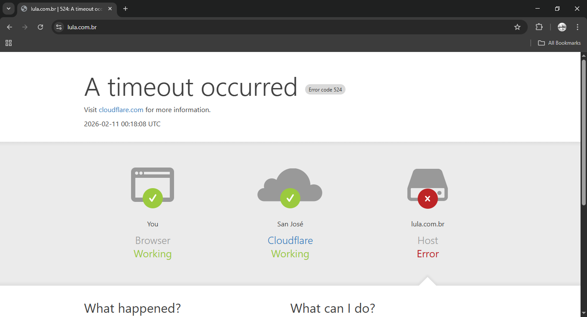
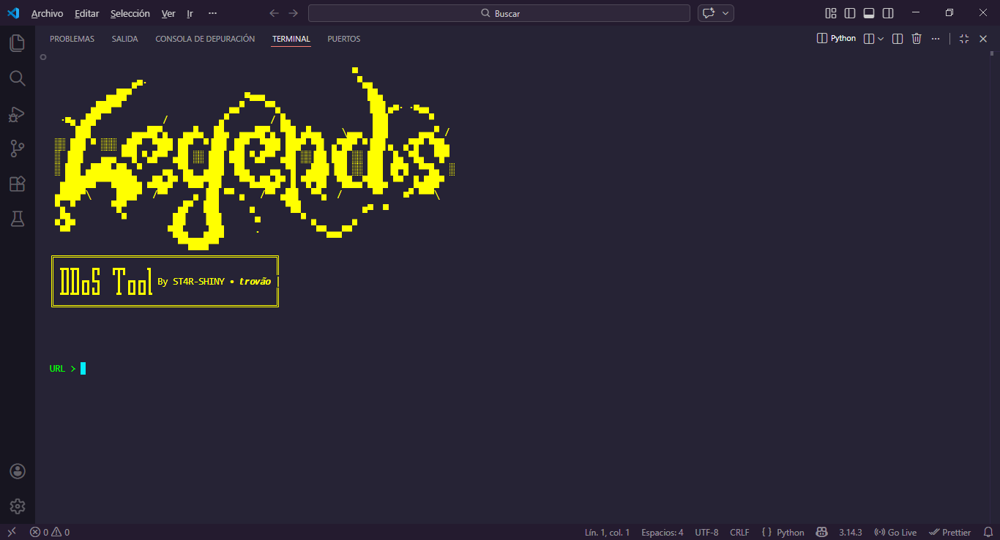

# 🔥 Legends-DDoS v1.0 - DDoS Tool 2026 🔥

<p align="center">
  
</p>

<p align="center">
  
</p>

**Legends-DDoS** It's an advanced traffic stress/distribution tool written in Python.
It supports HTTP/SOCKS proxies and includes a little botnet - new DDoS tool (2026).

**Main Features**
- GET/HEAD/POST bombardment with random payloads
- Intelligent proxy rotation
- Basic Cloudflare/WAF bypass (random headers + variable delays)
- Target URL input on startup

## Instalación

```bash

git clone https://github.com/ST4R-SHINY/Legends_DDoS_BotNet
cd Legends_DDoS_BotNet
python3 legacy.py

```

###- CREDITS

**- DDoS tool 2026 By Trovao - ST4R-SHINY**
